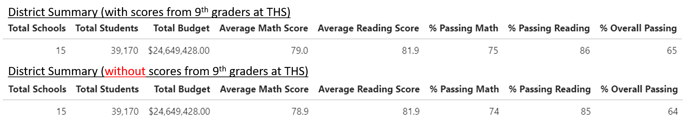
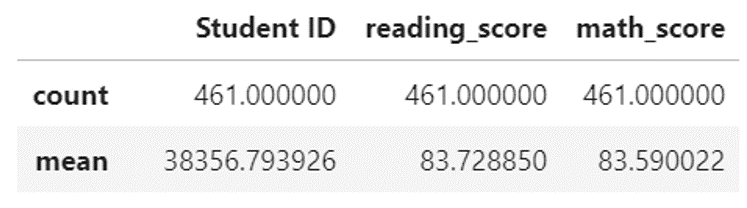
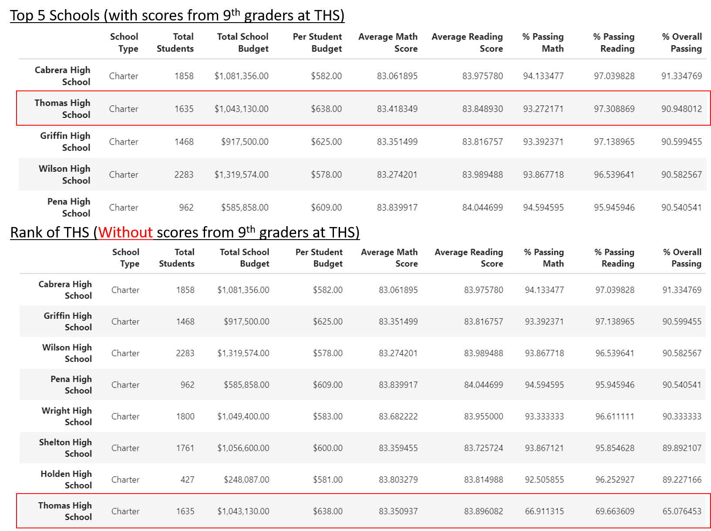
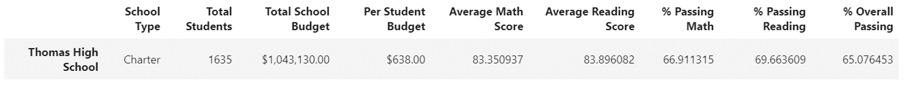
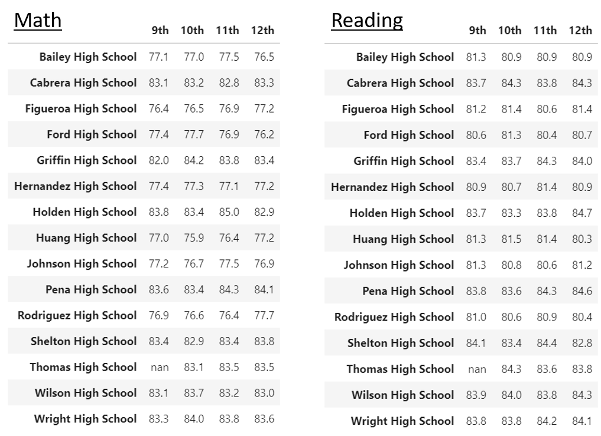

# School District Analysis
Module 04 of UofT Data Analytics Boot Camp

## Project Objective
Aim of the project is to provide State Board of Education, the impact of the Academic dishonesty conducted by the ninth graders at Thomas High School (THS) to the performance for standard tests at City School District.

## Project Overview & Resources
Data: 
* List of scores of Reading test and Math test for each students in City School District (Resources/students_complete.csv)
* List of schools in City School District and brief description of each school (Resources/schools_complete.csv)

Software: Python 3.7.6, Jupyter Lab

Handling of Data:
* Removed wrongly used prefixes and suffixes from students name (Resources/clean_students_complete.csv)
* Removed test scores of the ninth graders at THS
* Passing Grade for standard tests is 70 
 
NOTE: The scores of the ninth graders at THS are ignored for calculation of average scores. However other values such as the number of students are included in the calculation. (These students will be considered as failing the tests)

## 1. Impact to District Summary / School Summary
The table 1.a. below shows the students performance including & excluding the 9th graders at THS. Obviously there is little or almost no impact to the average scores and only 1% drop in the percentages of students passing the tests.

Table 1.a.

This is the expected results as;
* Number of 9th graders at THS is 461, which is only 1.2% of total students (39,170)
* Average scores of 9th graders at THS before data exclusion is relatively close to the overall average. (The magnitude of the impact would be the difference in mean value of test scores, 2 to 4 points, multiplied by 1.2%)

Table 1.b. Quick Summary of Excluded Data (9th graders at THS):

However, for THS, it has significant impact as shown in table 1.3..
* School Rank based on overall percentage of student who passed the test dropped from 2 to 8.
* THS is now the worst performer among the Charter schools.

## 2. Other impacts
Based on the quick summary of THS (Table 2.a.), excluding the test scores of 9th graders at THS would impact the following types of data.

1. Grade: 9th Grade
2. School Type: Charter
3. School Spending: Between 630 and 645 dollers per students
4. School Size: Medium (1000-2000 students)

Table 2.a. Summary of THS

Impact to each category is explained below.

Please note that the impact to percentage passing is roughly calculated using No. of the ninth graders at THS. (To calculate more accurately, we need to use the 416 minus the number of who did not pass each tests, which are 38 for overall, 30 for math and 9 for reading). 

2.1. Impact to results by grades
* No significant impact to results per school as the scores from 9th graders at THS is simply blanked out
* % Passing decreased by approx. 4% (= 416 @ THS / 11,408 total in this category)
* Approx. 0.1 drop in average math scroe and 0.2 drop in average reading score

2.2. Impact to results by school types
* % Passing decreased by approx. 3% (= 416 @ THS / 12,194 total in this category)
* No signigicant impact to average score 

2.3. Impact to results by Spending
* % Passing decreased by approx. 4% (= 416 @ THS / 11,322 total in this category)
* No signigicant impact to average score 

2.4. Impact to results by School Size
* % Passing decreased by approx. 5% (= 416 @ THS / 8,522 total in this category)
* No signigicant impact to average score

## Challenge Assignments
* For each output from DataFrames, please check "PyCitySchools_Challenge.ipynb" or following link: https://nbviewer.jupyter.org/github/TaishiMatsuda/School_District_Analysis/blob/master/PyCitySchools_Challenge.ipynb
* Why do we take average of average when creating the summaries by school type, spending per student & school size? Wouldn't it be better to cut & categorize the "school_data_complete_df" instead of "per_school_summary_df"? For example;
    * As removing the 9th graders results has almost no impact to the average scores of Thomas High School, there would also be no impact to average scores for each summaries.
